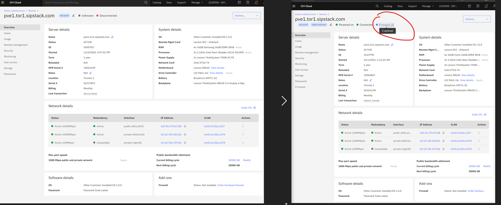

# IBM / SoftLayer "Gross Negligence" Event at TOR01 Datacenter
## Location of Datacenter
IBM Campus: CASL1
371 Gough Road Suite 130
Markham, ON
L3R 4B6 CANADA

## Event
Lenovo ThinkSystem SR630 system deployed in our IBM Cloud Bare Metal environment began to report a series of failing components. See [Summary](summary-of-events.docx) (open in Microsoft Word).

## Problem
IBM Site Manager reported issue likely caused by a Lenovo Systemboard firmware failed to be updated. The Lenovo notice was dated prior to when the IBM ThinkSystem SR630 was provisioned for SIPSTACK / client use, seemingly ignoring firmware notices.

The thread can be found in Case [CS2301154](CS2301154/README.md) Line# 223 by the TOR01 Site Manager.

The Intel SSD also affected was severly corrupted, without possibility of recovery. This [firmware update alert](Lenovo/lenovo-intel-ssd-alert.jpeg) has also been published by Lenovo in 2019. Dated well before delivery of our system order.

Lenovo published a [best practice guide](Lenovo/lenovo-firmware-update.pdf) to updating firmware, and its importance. 

## Security
Due to the extremely sensitve nature of data that exists in this region and passed on these drives, physical recovery of the disk were of the higest priority to ensure public interests are protected.

After nearly 3 weeks of attempting to recover the drive without limiting our damages, IBM released the equipment to us only with the intervention of our General and Special Counsel.

## Intellectual Property
The affected failed hardware also contained virtual server data including private git repositories. While nightly remote backups are employed, encryption to the highest levels are used including keys and digital fingerprints sourcing the originating hardware creating those backups. The disk recovered was physically damaged and impossible to recover or clone using enterprise available tools.

## IBM Cloud Support Case Threads
We have included a copy of the IBM Cloud support threads affecting this event referenced in table below:

> Efforts were made to partially redact full names and email addresses within posted correspondences to protect privacy. For any errors and omissions please contact privacy@sipstack.com should any identfying refence to personal information exist unredacted.

| Date | Case | Subject | 
| --- | --- | --- | 
| 2021-05-10 09:51:43 | [CS2301154](CS2301154/README.md) | 
| 2021-05-11 20:55:24 | [CS2303665](CS2303665/README.md) | Server down reference CS2301154 | 
| 2021-05-11 21:04:11 | [CS2303676](CS2303676/README.md) | Server down reference CS2301154 | 
| 2021-05-13 18:21:12 | [CS2306828](CS2306828/README.md) | Purchase of failed drive bthv6246008m800ogn | 

## SoftLayer Cloud Service Agreement
IBM / Softlayer General Counsel have provided us in writting that firmware updates are the responsibility of the client referencing their CSA, however unable to indentify where. There is however, a paragraph regarding warranty that supercedes other clauses, which prohibit customers from making any alterations or modifications or subject to voided warranty or termination of agreement. Section 4(b).

[Z126-6304-SoftLayerWW-8_03-2018.doc](Z126-6304-SoftLayerWW-8_03-2018.doc)

# The Good, the Bad, and the Ugly
## The Good
Companies, even very old and large corporations like IBM / Softlayer can learn from these events, and evidence thus far point in the positive direction that they have.

 - [new-notice-tech-refresh.png](assets/new-notice-tech-refresh.png) : On May 17th, 2021 (a week after the event), we received notification on the IBM Notification Portal of technology refresh specifically around delays provisioning new bare metal services in order to update firmwares to prevent hardware component failure.
 - [new-firmware-status.png](assets/new-firmware-status.png) : IBM bare betal servers now have a new status indicator regarding firmware availability. If this was not a new feature, then IBM / SoftLayer did not indicate any pending firmware updates previously as shown on [old-no-firmware-status.png](assets/old-no-firmware-status.png) from when the event occured.

 ### Before and after images of the same system
 

These are **very exiting features** and protocols to employ, making IBM / Softlayer a safer more attractive environment **only if their CSA discrepencies can be clarified & updated** and provide superior care to compliment the suprier price tag for their services. We have recently sent a letter to IBM / Softlayer General Counsel addressing this concern on the same date of this commit.

## The Bad
For SIPSTACK, the positive features may come too late. While our company (Federally backed by the Government of Canada) and licenced with the CRTC (Canadian Radio-television and Telecommunications Commission), have the highest responsiblity and obligation to the public's interest to both protect customer data, and to bring the best partners available in the industry, has reached an impasse. IBM / Softlayer are the biggest name in bare metal solutions, failed us from the very start. 

In addition to the event in question, we have remained unsupported for other equipment and services for nearly 2 months without response in regards to IBM Lenovo systems not working / unbootable referenced in [case CS2303676](CS2303676/README.md)

## The Ugly
In addition to the above, SIPSTACK Inc. has investested tremendously into the IBM / SoftLayer Bare Metal Architechture and Cloud SDKs to be in the position to provide global scalable solutions as a major export for Canada. SIPSTACK's global regional offerings promoted on our main landing website coincides with IBM / SoftLayer's datacenters, and within weeks of launching those regions, we were shocked when this critical failure occured, most of all with IBM / Softlayer. While resolution and damages could have been mitigated within 24 hours as inidcated in the [CS2301154](CS2301154/README.md) thread, IBM General Counsel / Paralegal intervention held us hostage with a liability waiver citing **'IBM's Gross Negligence'** limiting damages to $1,000 USD [Drive-Purchase-Addendum-January-2019.pdf](assets/Drive-Purchase-Addendum-January-2019.pdf). These are their words, not ours. 

Without a global bare metal partner like IBM / SoftLayer, finding an alternative vendor with a comprobable broad offering is extremely hard to come by. We will continue to investigate all options, including other cloud offerings enabling us to offer a hosted instance of our open source software within a globally managed secure VoIP environment for our customers.

# Notes
For any errors and omissions, please email info@sipstack.com.